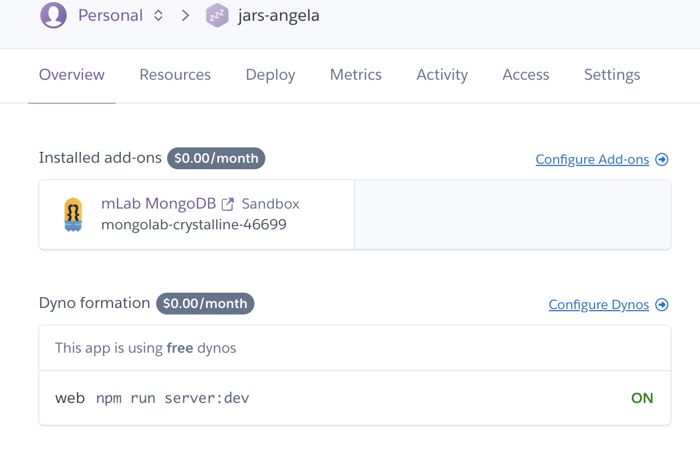
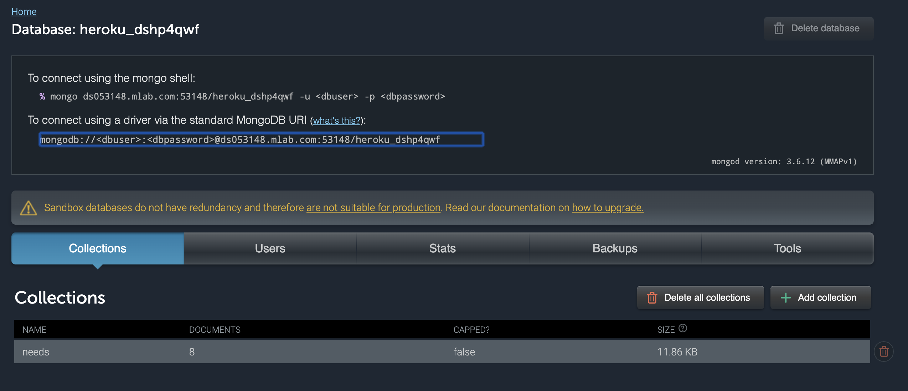
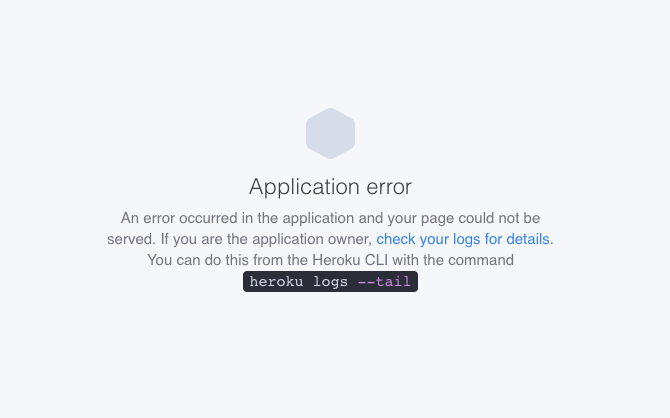

# About this article
This is not a full guide with explanations of what is happening at each step.

This is a cheatsheet to serve as a reference of all the commands you’ll need when pushing your Node.js / MongoDB app to 
Heroku.

Note: This guide assumes you have already set up git. If you have not, google "How to Set Up Git for an Existing Project"

This article only deploys the backend Node.js + MongoDB to Heroku. If you have a front end app, please see another article.

Make sure you have the file package.json in the root folder of the repo.

## Set up your Procfile
Before pushing to Heroku, we’ll have to create a file called Procfile, that lets Heroku know how to run your website. Go to your project repo and create that file in the root of the repo:

`$ cd ~/projects/path-to-your-project-folder`

`$ touch Procfile`

Inside Procfile add the following:

`web: npm run server:dev`

note this instruction is tell Heroku how to run your app. 

your file can be 

`web: npm run start`

or

`web: node server.js`

dependant on what inside your package.json.

## Set up your Heroku project
If you don’t have one yet, create a free Heroku account. It’s a free service — but you may need to input your credit card details to sign up or add some Add-ons.

## Install the Heroku Command Line interface if you have not already. 

(Google how to install)

## Create a Heroku app and name it

`$ heroku create your-project-name`

## Add your repository to Heroku git

`$ heroku git:remote -a your_project_name` 

Check if it works by running the following command:

`$ git remote -v`

You should see something like this:

```
$ heroku https://git.heroku.com/unique-project-name.git (fetch)
$ heroku https://git.heroku.com/unique-project-name.git (push)
$ origin git@github.com:nsafai/Your-Git-Repo.git (fetch)
$ origin git@github.com:nsafai/Your-Git-Repo.git (push)
```

## Set run environment( tell Heroku what your app language is ) 

`$ heroku buildpacks:set heroku/nodejs`

## Push your Procfile to Heroku

```
$ git add . 
$ git commit -m “setting up to push to Heroku”
$ git push heroku master
```

## Spin up a Server
Assign a free server to run the website:

`$ heroku ps:scale web=1`

## Set up your Production Database
Create a database to host your production data:

`$ heroku addons:create mongolab:sandbox`

Read Heroku carefully, you may need a credit card detail to continue. The sandbox may be free but check carefully before you continue. 

When you were successfully done this, you should see the page like this 




Click mLab MongoDB, you were able to see the page like this, give you the detail of your remote database.




If you haven’t already, make sure your app.js or server.js file has the correct line of code to connect to your production DB:

## get env variable MONGODB_URI

Make sure your MONGODB_URI is correct with username and password, you can use 

`$ heroku config:get MONGODB_URI` 

to check. 

Sometimes the MONGODB_URI is using default username which is long and not easy to remember, you can add a new database username and set a password. And set the new MONGODB_URI using the new username and password you set. 

You may set the heroku Config Vars using the command below:

`$ heroku config:set MONGODB_URI=mongodb://<username>:<password>@ds053148.mlab.com:53148/heroku_dshp4qwf`

You can use mongo shell to check your username and password ok to connect. 

`$ mongo ds053148.mlab.com:53148/heroku_dshp4qwf -u <dbuser> -p <dbpassword>`

If there has no authentication problem, you can refactor your connect code. 

```
// app.js or server.js
// You may need this line to get the Environment variables

require('dotenv').config();

const url = process.env.MONGODB_URI || "mongodb://localhost:27017";

// you may hard code the link, but not recommond 

//const url = "mongodb://<username>:<password>@ds053148.mlab.com:53148/heroku_dshp4qwf";

MongoClient.connect(url)

.then((client) => {

const db = client.db('heroku_dshp4qwf');

const needsCollection = db.collection('needs'); //  collection name

const needsRouter = createRouter(needsCollection);

app.use('/api/needs', needsRouter);

})

.catch(console.err);

const port = process.env.PORT || 3000;

app.listen(port, function () {

// console.log(`App running on port ${ this.address().port }`);

console.log(`App running on port ${port}`);

});
```

Note: you may need to install the dotenv npm package for the above to work correctly:


run 

`$ npm install dotenv`

or 

`$ yarn add dotenv`

import dotenv at the top of your app.js / server.js file:

```
// app.js or server.js
require('dotenv').config()
// REST OF YOUR CODE
```

## Configure your port settings

Set the port to Heroku’s production port. In your app.js file (or sometimes, bin/www/server.js file), change your app.listen to the following:

```
// At the bottom of app.js or server.js
const port = process.env.PORT || 3000;
app.listen(port);
// the code above should be directly above: 'module.exports = app;
```

## Push your code up to GitHub:

```
$ git add . 
$ git commit -m “setting up to push to Heroku”
$ git push origin master
```

## Push your code up to Heroku:

`$ git push heroku master`

That’s it, go check if it worked!
Cross your fingers and see if it worked by using the command:

`$ heroku open`

🥂🎉🎊🙌🔥 Your app is on the web! 🔥🙌🎊🎉🥂

Oh no! Are you seeing this page?




Classic. Almost everybody sees this the first time they push their app to Heroku
If you see the screen above, run this command:

`$ heroku logs --tail`

Scroll up to the top of the error logs and google them one by one.

If you get stuck and can’t resolve the problem using Google, comment below with your situation and what you’ve already tried and I’ll do my best to help.

## Reference 

[How to deploy your Node.js / MongoDB app to the web, using Heroku!](https://medium.com/make-school/how-to-deploy-your-node-js-mongodb-app-to-the-web-using-heroku-63d4bccf2675)

[Express Tutorial Part 7: Deploying to production!](https://developer.mozilla.org/en-US/docs/Learn/Server-side/Express_Nodejs/deployment)

[https://developer.mozilla.org/en-US/docs/Learn/Server-side/Express_Nodejs/deployment!](https://devcenter.heroku.com/articles/mean-apps-restful-api#provision-a-mongodb-database)

[Heroku连接云端MongoDB的方法!](https://blog.csdn.net/congyihao/article/details/60747447)

